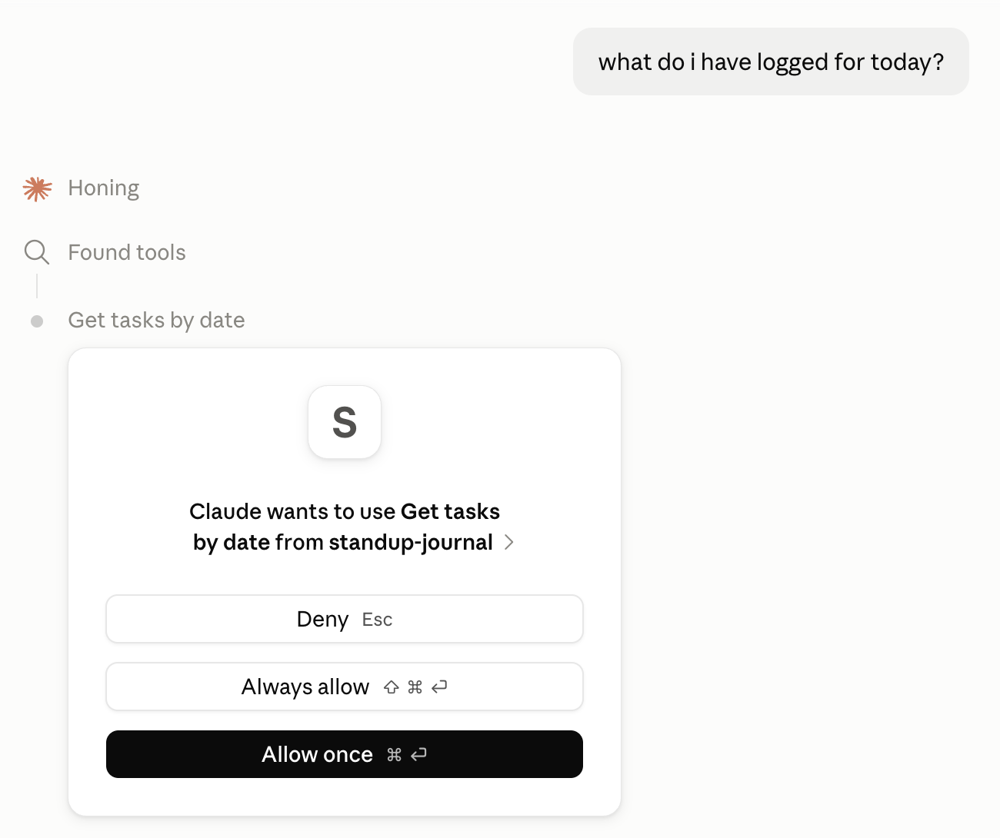
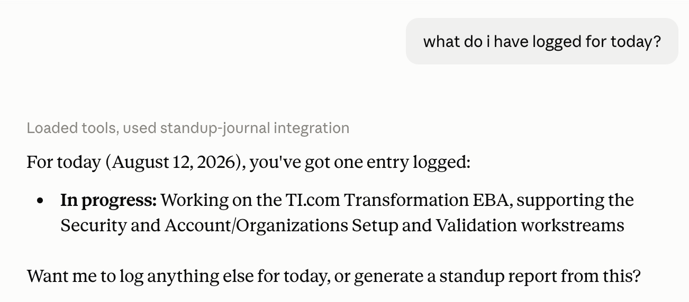
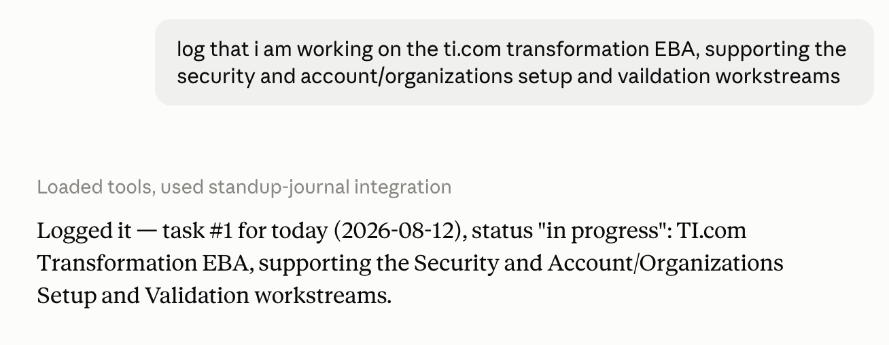

# Standup Journal MCP

A personal standup journal as an MCP server — log tasks, generate standup reports, and manage a checklist dashboard, all from Claude Desktop.

## One Dataset, Two Views

The standup log tools and the checklist dashboard both read from and write to the **same underlying task table** — they are not separate stores. An item logged with `log_task` shows up in `get_checklist` and the dashboard, and vice versa, using the same task IDs.

- **Standup log tools** (`log_task`, `get_tasks_by_date`, `get_tasks_between`, `generate_standup_report`) present tasks as a dated journal — good for "what did I do on Aug 12" or generating a Slack-ready standup message.
- **Checklist dashboard** (`get_checklist`, `add_checklist_item`, `toggle_checklist_item`, `delete_checklist_item`, `open_checklist_dashboard`) presents the same tasks as a checkable to-do list at `http://localhost:9249`.

In short: it's one list of tasks, viewable either as a standup journal or as a checklist — pick whichever framing suits what you're trying to do in the moment.

## Following Along (YouTube Tutorial)

This project follows [MCP Tutorial: Build Your First MCP Server](https://www.youtube.com/watch?v=jLM6n4mdRuA), adapted for `uv` and the current v2 SDK.

### Step 1: Initialize the project

```bash
uv init
uv add "mcp[cli]"
```

### Step 2: Write the server

Create `main.py` in the project root. The server uses `MCPServer` from `mcp.server` with `@mcp.tool()` decorators.

**Note:** The video uses `FastMCP` from `mcp.server.fastmcp` (v1.x SDK). `uv add "mcp[cli]"` today installs v2, where `FastMCP` was renamed `MCPServer` and moved to `mcp.server`. Decorators are unchanged.

Data lives in `~/.standup-journal/standups.db` (override with `STANDUP_DB_PATH`).

### Step 3: Install into Claude Desktop

```bash
uv run mcp install main.py
```

Fully quit and reopen Claude Desktop for the server to appear.

### Step 4: Verify in Claude Desktop

Open **Settings → Developer → Edit Config** to confirm `standup-journal` is listed under `mcpServers`. Restart Claude Desktop, then check **Connectors** — your tools should be available.

---

## Tools

### Standup log — what you did / are doing / are blocked on

| Tool | Description |
|------|-------------|
| `log_task` | Log what you did/are doing/are blocked on. Supports tags, due dates, deduplicates recurring blockers, and normalizes natural-language statuses (e.g. "todo" → in_progress). |
| `update_task_status` | Change a task's status (done, in_progress, blocked). |
| `get_tasks_by_date` | View tasks for a specific date. Optional tag filter. |
| `get_tasks_between` | View tasks across a date range. Optional tag filter. |
| `list_tags` | See all tags in use with open task counts. |
| `generate_standup_report` | Slack-ready standup message. Set `include_weekly=True` for a 7-day rollup. |

Tags get a consistent royal-themed emoji (👑💎🦋🕯️ etc.) assigned automatically per tag name.

### Checklist dashboard — what you need to do

| Tool | Description |
|------|-------------|
| `add_checklist_item` | Add a task (or subtask) to the checklist. Supports nested subtasks. |
| `delete_checklist_item` | Remove a task by ID (recursively deletes nested subtasks). |
| `toggle_checklist_item` | Toggle done/not-done. |
| `get_checklist` | View all tasks as a checklist. |
| `open_checklist_dashboard` | Get the localhost URL for the interactive HTML dashboard. |

Due dates are parsed from natural language by Claude (e.g. "due Aug 20") and displayed in the dashboard. Tasks with due dates sort to the top; overdue dates show in red.

---

## Interactive Checklist Dashboard

The server starts a local HTTP server on **port 9249** (override with `CHECKLIST_PORT`) alongside the MCP stdio transport. The dashboard at `http://localhost:9249` provides an interactive checklist with progress tracking, nested subtasks, due dates, and tag badges. Use it as your working to-do list — items you still need to do, not a record of what's already happened.

```bash
# Run standalone (starts MCP server + dashboard)
uv run python main.py

# Custom port
CHECKLIST_PORT=8080 uv run python main.py
```

Only binds to localhost — not exposed to the network.

---

## Testing in Claude Desktop

Try these:

1. > "Log that I finished the login screen styling."
2. > "Log that I'm blocked on AWS permissions, tag it infra."
3. > "Log that the API docs are due Friday, tag it github."
4. > "What have I logged for today?"
5. > "Generate my standup report."





Verify data directly:

```bash
sqlite3 ~/.standup-journal/standups.db "SELECT * FROM tasks;"
```

### Troubleshooting

- **Connector won't connect:** Check `~/Library/Logs/Claude/mcp-server-standup-journal.log` (macOS) or `%APPDATA%\Claude\logs\` (Windows).
- **Stray stdout corrupts the connection** — use `logging` (stderr), never `print()`.

Sources: [MCP docs](https://modelcontextprotocol.io/docs/2026-07-28/develop/connect-local-servers), [Claude MCP troubleshooting](https://claude.com/docs/connectors/building/mcp-apps/troubleshooting), [PyPI MCP](https://pypi.org/project/mcp/)